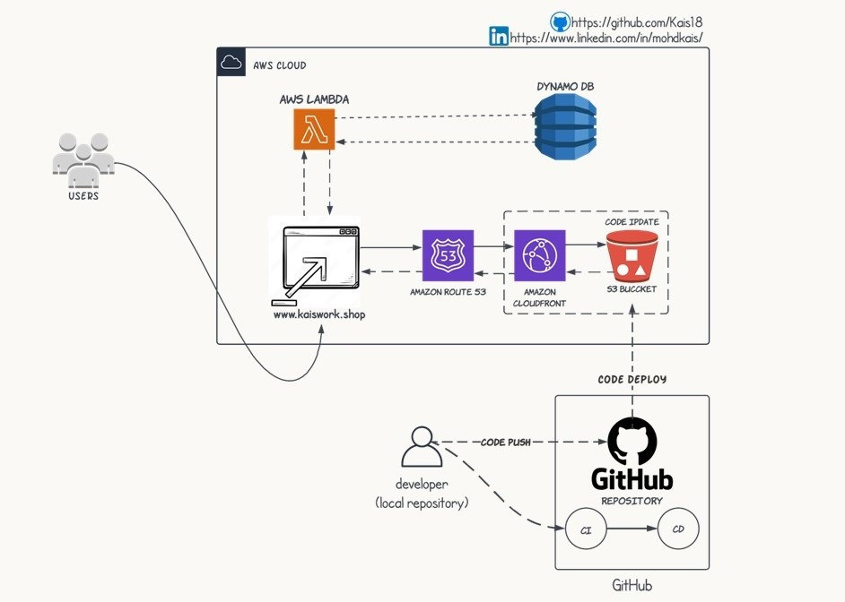

# AWS Cloud Resume/Portfolio

This is the complete architecture and workflow of cloud resume known as portfolio using  AWS services. What is Cloud resume/ Portfolio? - The Cloud Resume is a multiple-step resume project which helps build and demonstrate skills fundamental to pursuing a career in Cloud.

## Architecture

**Services Used**:

- S3
- AWS CloudFront
- Certificate Manager
- AWS Lambda
- Dynamo DB
- GitHub Actions
- Terraform

## [Live Demo 🔗](https://www.kaiswork.shop)
The Live Demo is up click on the "Live Demo"

## Blog Series
- 1. [What is the Cloud Resume/ Portfolio?](https://dev.to/aws-builders/what-is-the-cloud-resume-challenge-ma5)

## Author
- Twitter: [@kaissssssss08](https://twitter.com/kaissssssss08)
- LinkedIn:[mohdkais](https://www.linkedin.com/in/mohdkais/)
- Portfoli:[kaiswork.shop](https://www.kaiswork.shop)
